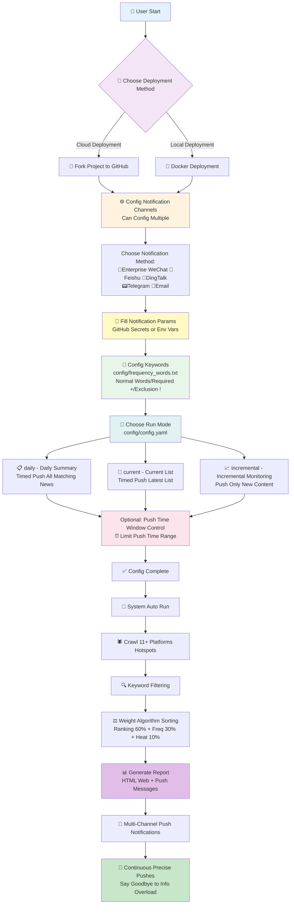

# TrendRadar

<div align="center" id="trendradar">

<a href="https://github.com/memarzade-dev/TrendRadar" title="TrendRadar">
  
</a>

🚀 The Fastest 30-Second Deployment Hotspot Assistant — Say Goodbye to Mindless Scrolling, Focus Only on the News That Matters

<a href="https://trendshift.io/repositories/14726" target="_blank"></a>

[](https://github.com/memarzade-dev/TrendRadar/stargazers)
[](https://github.com/memarzade-dev/TrendRadar/network/members)
[](LICENSE)
[](https://github.com/memarzade-dev/TrendRadar)
[](https://github.com/memarzade-dev/TrendRadar)

[](https://work.weixin.qq.com/)
[](https://telegram.org/)
[](#)
[](https://www.feishu.cn/)
[](#) 
[](https://github.com/binwiederhier/ntfy)


[](https://github.com/memarzade-dev/TrendRadar)
[](https://memarzade-dev.github.io/TrendRadar)
[](https://hub.docker.com/r/wantcat/trendradar)
[](https://modelcontextprotocol.io/)

</div>


> This project focuses on being lightweight and easy to deploy.

## 📑 Quick Navigation

<div align="center">

| [🎯 Core Features](#-core-features) | [🚀 Quick Start](#-quick-start) | [🐳 Docker Deployment](#-docker-deployment) | [🤖 AI Analysis Section](#-ai-intelligent-analysis-deployment) |
|:---:|:---:|:---:|:---:|
| [📝 Changelog](#-changelog) | [🔌 MCP Client](#-mcp-client) | [❓ FAQ and Common Issues](#faq-and-1-yuan-donation) | [⭐ Project Related](#project-related) |
| [🔧 Custom Monitoring Platforms](#custom-monitoring-platforms) | [📝 frequency_words.txt Configuration](#frequencywordstxt-configuration-tutorial) | | |

</div>

- Thanks to **contributors who patiently report bugs**, your feedback makes the project better 😉;  
- Thanks to **viewers who star the project**, **forking** and **starring** are both appreciated 😍—it's the best support for open source;  
- Thanks to **readers who follow the [official account](#faq-and-1-yuan-donation)**, your comments, likes, shares, and recommendations add warmth to the content 😎.  

<details>
<summary>👉 Click to view <strong>Acknowledgments List</strong> (currently <strong>🔥66🔥</strong> contributors)</summary>

### Data Support

This project uses APIs from the [newsnow](https://github.com/ourongxing/newsnow) project to fetch multi-platform data.

### Promotion Assistance

> Thanks to the following platforms and individuals for their recommendations (in chronological order)

- [Appinn](https://mp.weixin.qq.com/s/fvutkJ_NPUelSW9OGK39aA) - Open-source software recommendation platform
- [LinuxDo Community](https://linux.do/) - Gathering place for tech enthusiasts
- [Ruanyifeng Weekly](https://github.com/ruanyf/weekly) - Influential tech weekly newsletter

### Viewer Support

> Thanks to friends who provided **financial support**; your generosity has turned into snacks and drinks by the keyboard, accompanying every project iteration.

|           Donor            |  Amount  |  Date  |             Remarks             |
| :-------------------------: | :----: | :----: | :-----------------------: |
|           *Hai          |  1  | 2025.11.15  |    | 
|           *De          |  1.99  | 2025.11.15  |    | 
|           *Shu          |  8.8  | 2025.11.14  |  Thanks for open-sourcing, great project, showing support   | 
|           M*e          |  10  | 2025.11.14  |  Open-source is not easy, hard work boss   | 
|           **Ke          |  1  | 2025.11.14  |     | 
|           *Yun          |  88  | 2025.11.13  |    Good project, thanks for open-sourcing  | 
|           *W          |  6  | 2025.11.13  |      | 
|           *Kai          |  1  | 2025.11.13  |      | 
|           Dui*.          |  1  | 2025.11.13  |    Thanks for your TrendRadar  | 
|           s*y          |  1  | 2025.11.13  |      | 
|           **Xiang          |  10  | 2025.11.13  |   Good project, wish I found it earlier, thanks for open-sourcing!     | 
|           *Wei          |  9.9  | 2025.11.13  |   TrendRadar is awesome, treat the teacher to coffee~     | 
|           h*p          |  5  | 2025.11.12  |   Support Chinese open-source power, keep going!     | 
|           c*r          |  6  | 2025.11.12  |        | 
|           a*n          |  5  | 2025.11.12  |        | 
|           。*c          |  1  | 2025.11.12  |    Thanks for sharing open-source    | 
|           *Ji          |  1  | 2025.11.11  |        | 
|           *Zhu          |  1  | 2025.11.10  |        | 
|           *Le          |  10  | 2025.11.09  |        | 
|           *Jie          |  5  | 2025.11.08  |        | 
|           *Dian          |  8.80  | 2025.11.07  |   Development is not easy, showing support.     | 
|           Q*Q          |  6.66  | 2025.11.07  |   Thanks for open-sourcing!     | 
|           C*e          |  1  | 2025.11.05  |        | 
|           Peter Fan          |  20  | 2025.10.29  |        | 
|           M*n          |  1  | 2025.10.27  |      Thanks for open-sourcing  | 
|           *Xu          |  8.88  | 2025.10.23  |      Teacher, newbie here, been tinkering for days without success, seeking advice  | 
|           Eason           |  1  | 2025.10.22  |      Haven't figured it out yet, but you're doing good work  | 
|           P*n           |  1  | 2025.10.20  |          |
|           *Jie           |  1  | 2025.10.19  |          |
|           *Xu           |  1  | 2025.10.18  |          |
|           *Zhi           |  1  | 2025.10.17  |          |
|           *😀           |  10  | 2025.10.16  |     Like     |
|           **Jie           |  10  | 2025.10.16  |          |
|           *Xiao           |  10  | 2025.10.16  |          |
|           *Ji           |  5  | 2025.10.14  | TrendRadar         |
|           J*d           |  1  | 2025.10.14  | Thanks for your tool, it's fun...          |
|           *H           |  1  | 2025.10.14  |           |
|           Na*O           |  10  | 2025.10.13  |           |
|           *Yuan           |  1  | 2025.10.13  |           |
|           P*g           |  6  | 2025.10.13  |           |
|           Ocean           |  20  | 2025.10.12  |  ...Really awesome!!! Even beginners can use it directly...         |
|           **Pei           |  5.2  | 2025.10.2  |  github-yzyf1312: Long live open-source         |
|           *Chun           |  3  | 2025.9.23  |  Keep going, it's great         |
|           *🍍           |  10  | 2025.9.21  |           |
|           E*f           |  1  | 2025.9.20  |           |
|           *Ji            |  1  | 2025.9.20  |           |
|           z*u            |  2  | 2025.9.19  |           |
|           **Hao            |  5  | 2025.9.17  |           |
|           *Hao            |  1  | 2025.9.15  |           |
|           T*T            |  2  | 2025.9.15  |  Like         |
|           *Jia            |  10  | 2025.9.10  |           |
|           *X            |  1.11  | 2025.9.3  |           |
|           *Biao            |  20  | 2025.8.31  |  From Lao Tong, thanks         |
|           *Xia            |  1  | 2025.8.30  |           |
|           2*D            |  88  | 2025.8.13 PM |           |
|           2*D            |  1  | 2025.8.13 AM |           |
|           S*o            |  1  | 2025.8.05 |   Showing support        |
|           *Xia            |  10  | 2025.8.04 |           |
|           x*x            |  2  | 2025.8.03 |  TrendRadar good project, like          |
|           *Yuan            |  1  | 2025.8.01 |            |
|           *Xie            |  5  | 2025.8.01 |            |
|           *Meng            |  0.1  | 2025.7.30 |            |
|           **Long            |  10  | 2025.7.29 |      Showing support      |


</details>


## ✨ Core Features

### **Multi-Platform Hotspot Aggregation**

- Zhihu
- Douyin
- Bilibili Hot Search
- Wall Street Insights
- Tieba
- Baidu Hot Search
- Caijing Hot
- The Paper
- Phoenix News
- Toutiao
- Weibo

By default, monitors 11 mainstream platforms, and you can add additional platforms yourself.

<details id="custom-monitoring-platforms">
<summary><strong>👉 Click to expand: Custom Monitoring Platforms</strong></summary>
<br>

The news data for this project comes from [newsnow](https://github.com/ourongxing/newsnow). You can visit the [website](https://newsnow.busiyi.world/), click [More], and check if there are platforms you want.

For specific additions, visit the [project source code](https://github.com/ourongxing/newsnow/tree/main/server/sources), and modify the `platforms` configuration in the `config/config.yaml` file based on the file names:

```yaml
platforms:
  - id: "toutiao"
    name: "Toutiao"
  - id: "baidu"  
    name: "Baidu Hot Search"
  - id: "wallstreetcn-hot"
    name: "Wall Street Insights"
  # Add more platforms...
```
If you're unsure, you can directly copy some pre-organized [platform configurations](https://github.com/sansan0/TrendRadar/issues/95).

</details>

### **Intelligent Push Strategies**

**Three Push Modes**:

| Mode | Target Users | Push Timing | Display Content | Applicable Scenarios |
|------|----------|----------|----------|----------|
| **Daily Summary**<br/>`daily` | 📋 Business Managers/General Users | Timed Push (default every hour) | All matching news for the day<br/>+ New news section | Daily reports<br/>Comprehensive understanding of daily hotspot trends |
| **Current List**<br/>`current` | 📰 Self-Media/Content Creators | Timed Push (default every hour) | Current list matching news<br/>+ New news section | Real-time hotspot tracking<br/>Understand the hottest content now |
| **Incremental Monitoring**<br/>`incremental` | 📈 Investors/Traders | Push only when new additions | Newly appeared matching frequency word news | Avoid repeated information interference<br/>High-frequency monitoring scenarios |

**Additional Feature - Push Time Window Control** (Optional):

This feature is independent of the above three push modes and can be used with any mode:

- **Time Window Restriction**: Set push time range (e.g., 09:00-18:00 or 20:00-22:00), push only within specified time
- **Push Frequency Control**:
  - Multiple pushes within window: Push every execution within the time window
  - Daily single push: Push only once within the time window (suitable for daily summary or current list mode)
- **Typical Scenarios**:
  - Work time pushes: Receive messages only during workdays 09:00-18:00
  - Evening summary pushes: Receive summaries at fixed evening times (e.g., 20:00-22:00)
  - Avoid disturbances: Prevent pushes during non-working hours

> Tip: This feature is disabled by default and needs to be manually enabled in `config/config.yaml` under `push_window.enabled`.

### **Precise Content Filtering**

Set personal keywords (e.g., AI, BYD, Education Policy), and push only related hotspots, filtering irrelevant information.

- Supports three syntaxes: normal words, required words (+), exclusion words (!). See [frequency_words.txt Configuration Tutorial]
- Group management, independent statistics for different themes.

> You can also opt out of filtering to push all hotspots. See v2.0.1 in [Historical Updates].

<details id="frequencywordstxt-configuration-tutorial">
<summary><strong>👉 Click to expand: frequency_words.txt Configuration Tutorial</strong></summary>
<br>

Configure monitored keywords in the `frequency_words.txt` file, supporting three syntaxes and grouping features.

Keywords higher up have higher news priority; adjust the order based on your interest level.

| Syntax Type | Symbol | Function | Example | Matching Logic |
|---------|------|------|------|---------|
| **Normal Word** | None | Basic Matching | `Huawei` | Matches if any one is included |
| **Required Word** | `+` | Scope Limitation | `+Phone` | Must include simultaneously |
| **Exclusion Word** | `!` | Exclude Interference | `!Ad` | Exclude if included |

### 📋 Basic Syntax Explanation

#### 1. **Normal Keywords** - Basic Matching
```txt
Huawei
OPPO
Apple
```
**Function:** News titles containing **any one word** will be captured.

#### 2. **Required Word** `+Word` - Scope Limitation  
```txt
Huawei
OPPO
+Phone
```
**Function:** Must include both normal words **and** required words to be captured.

#### 3. **Exclusion Word** `!Word` - Exclude Interference
```txt
Apple
Huawei
!Fruit
!Price
```
**Function:** News containing exclusion words will be **directly excluded**, even if keywords are present.

### 🔗 Grouping Feature - Blank Lines for Separation

**Core Rule:** Use **blank lines** to separate different groups; each group is statistically independent.

#### Example Configuration:
```txt
iPhone
Huawei
OPPO
+Release

A-Shares
SSE
SZSE
+Rise/Fall
!Prediction

World Cup
Euro Cup
Asian Cup
+Match
```

#### Group Explanation and Matching Effects:

**Group 1 - Phone New Product Category:**
- Keywords: iPhone, Huawei, OPPO
- Required Word: Release
- Effect: Must include phone brand name and "Release"

**Matching Examples:**
- ✅ "iPhone 15 Officially Released with Price Announced" ← Has "iPhone"+"Release"
- ✅ "Huawei Mate60 Series Release Live" ← Has "Huawei"+"Release"
- ✅ "OPPO Find X7 Release Time Confirmed" ← Has "OPPO"+"Release"
- ❌ "iPhone Sales Hit Record High" ← Has "iPhone" but lacks "Release"

**Group 2 - Stock Market Trends Category:**  
- Keywords: A-Shares, SSE, SZSE
- Required Word: Rise/Fall
- Exclusion Word: Prediction
- Effect: Include stock-related words, with "Rise/Fall", but exclude those with "Prediction"

**Matching Examples:**
- ✅ "A-Shares Major Rise/Fall Analysis Today" ← Has "A-Shares"+"Rise/Fall"
- ✅ "SSE Index Rise/Fall Reasons Explained" ← Has "SSE"+"Rise/Fall"
- ❌ "Experts Predict A-Shares Rise/Fall Trends" ← Has "A-Shares"+"Rise/Fall" but includes "Prediction"
- ❌ "A-Shares Trading Volume Hits Record" ← Has "A-Shares" but lacks "Rise/Fall"

**Group 3 - Soccer Events Category:**
- Keywords: World Cup, Euro Cup, Asian Cup
- Required Word: Match
- Effect: Must include cup name and "Match"

**Matching Examples:**
- ✅ "World Cup Group Stage Match Results" ← Has "World Cup"+"Match"
- ✅ "Euro Cup Final Match Time" ← Has "Euro Cup"+"Match"
- ❌ "World Cup Tickets On Sale" ← Has "World Cup" but lacks "Match"

### 🎯 Configuration Tips

#### 1. **From Broad to Strict Configuration Strategy**
```txt
# Step 1: Test with broad keywords first
Artificial Intelligence
AI
ChatGPT

# Step 2: Add required words to limit after finding mismatches
Artificial Intelligence  
AI
ChatGPT
+Technology

# Step 3: Add exclusion words after finding interferences
Artificial Intelligence
AI  
ChatGPT
+Technology
!Ad
!Training
```

#### 2. **Avoid Over-Complexity**
❌ **Not Recommended:** One group with too many words
```txt
Huawei
OPPO
Apple
Samsung
vivo
OnePlus
Meizu
+Phone
+Release
+Sales
!Fake
!Repair
!Second-Hand
```

✅ **Recommended:** Split into multiple precise groups
```txt
Huawei
OPPO
+New Product

Apple
Samsung  
+Release

Phone
Sales
+Market
```

</details>


### **Hotspot Trend Analysis**

Real-time tracking of news heat changes, so you not only know "what's trending" but also "how hotspots evolve".

- **Timeline Tracking**: Records the full time span of each news from first appearance to last.
- **Heat Changes**: Counts ranking changes and appearance frequency in different periods.  
- **New Detection**: Real-time identification of new hotspot topics, marked with 🆕 for immediate alerts.
- **Persistence Analysis**: Distinguishes one-time hotspots from ongoing fermenting in-depth news.
- **Cross-Platform Comparison**: Same news performance across platforms, revealing media attention differences.

> No longer miss the full development process of important news, from topic budding to peak discussion, fully grasp it.

<details>
<summary><strong>👉 Click to expand: Push Format Explanation</strong></summary>
<br>

📊 Hotspot Vocabulary Statistics

🔥 [1/3] AI ChatGPT : 2 items

  1. [Baidu Hot Search] 🆕 ChatGPT-5 Officially Released [**1**] - 09:15 (1 time)
  
  2. [Toutiao] AI Chip Concept Stocks Surge [**3**] - [08:30 ~ 10:45] (3 times)
  
━━━━━━━━━━━━━━━━━━━

📈 [2/3] BYD Tesla : 2 items

  1. [Weibo] 🆕 BYD Monthly Sales Break Record [**2**] - 10:20 (1 time)
  
  2. [Douyin] Tesla Price Cut Promotion [**4**] - [07:45 ~ 09:15] (2 times)

━━━━━━━━━━━━━━━━━━━

📌 [3/3] A-Shares Stock Market : 1 item

  1. [Wall Street Insights] A-Shares Midday Review Analysis [**5**] - [11:30 ~ 12:00] (2 times)

🆕 New Hotspot News This Time (Total 2 items)

**Baidu Hot Search** (1 item):
  1. ChatGPT-5 Officially Released [**1**]

**Weibo** (1 item):
  1. BYD Monthly Sales Break Record [**2**]

Update Time: 2025-01-15 12:30:15


## **Message Format Explanation**

| Format Element      | Example                        | Meaning         | Explanation                                    |
| ------------- | --------------------------- | ------------ | --------------------------------------- |
| 🔥📈📌        | 🔥 [1/3] AI ChatGPT        | Heat Level     | 🔥High Heat (≥10 items) 📈Medium Heat (5-9 items) 📌Normal Heat (<5 items) |
| [No./Total]   | [1/3]                       | Ranking Position     | Current group's ranking among all matching groups          |
| Frequency Group      | AI ChatGPT                  | Keyword Group     | Words from config file; title must include them   |
| : N items        | : 2 items                      | Matching Count     | Total news matches for this group                    |
| [Platform Name]      | [Baidu Hot Search]                  | Source Platform     | Platform name for the news                      |
| 🆕            | 🆕 ChatGPT-5 Officially Released        | New Mark     | First appearance in this crawl round                |
| [**Number**]    | [**1**]                     | High Ranking       | Ranking ≤ threshold, bold red display           |
| [Number]        | [7]                         | Normal Ranking     | Ranking > threshold, normal display               |
| - Time        | - 09:15                  | First Time     | Time when the news was first discovered                  |
| [Time~Time]   | [08:30 ~ 10:45]       | Duration     | Range from first to last appearance          |
| (N times)         | (3 times)                       | Appearance Frequency     | Total appearances during monitoring                  |
| **New Section**  | 🆕 **New Hotspot News This Time**      | New Topic Summary   | Separately display new hotspots this round            |

</details>


### **Personalized Hotspot Algorithm**

No longer led by each platform's algorithm; TrendRadar reorganizes the entire web's hot searches:

- **Prioritize High Rankings** (60%): Top-ranked news from platforms displayed first
- **Focus on Persistent Topics** (30%): Repeatedly appearing news is more important  
- **Consider Ranking Quality** (10%): Not just frequent, but often in top positions

> Merge hot searches scattered across platforms, reorder by the heat you care about; these three ratios can be adjusted for your scenario.

<details>
<summary><strong>👉 Click to expand: Hotspot Weight Adjustment</strong></summary>
<br>

The current default is a balanced configuration.

### Two Core Scenarios

**Real-Time Hotspot Chaser**:
```yaml
weight:
  rank_weight: 0.8    # Focus mainly on ranking
  frequency_weight: 0.1  # Less concerned with persistence
  hotness_weight: 0.1
```
**Target Users**: Self-media bloggers, marketers, users wanting quick access to current hottest topics.

**Depth Topic Chaser**:
```yaml
weight:
  rank_weight: 0.4    # Moderate focus on ranking
  frequency_weight: 0.5  # Emphasize intra-day persistence heat
  hotness_weight: 0.1
```
**Target Users**: Investors, researchers, journalists, users needing deep trend analysis.

### Adjustment Method
1. **Three numbers must sum to 1.0**
2. **Increase what matters**: Raise rank_weight for ranking, frequency_weight for persistence.
3. **Suggest adjusting 0.1-0.2 each time**, observe effects.

Core Idea: Users pursuing speed and timeliness increase ranking weight; those pursuing depth and stability increase frequency weight.

</details>

### **Multi-Channel Real-Time Pushes**

Supports **Enterprise WeChat** (+ WeChat push solution), **Feishu**, **DingTalk**, **Telegram**, **Email**, **ntfy**, with messages delivered directly to phones and emails.

### **Multi-Device Adaptation**
- **GitHub Pages**: Automatically generates beautiful web reports, adapted for PC/mobile.
- **Docker Deployment**: Supports multi-architecture containerized operation.
- **Data Persistence**: Saves historical records in HTML/TXT multiple formats.


### **AI Intelligent Analysis (v3.0.0 New)**

AI conversational analysis system based on MCP (Model Context Protocol), allowing deep mining of news data using natural language.

- **Conversational Query**: Ask in natural language, e.g., "Query yesterday's Zhihu hotspots", "Analyze Bitcoin's recent heat trends".
- **13 Analysis Tools**: Covers basic queries, intelligent search, trend analysis, data insights, sentiment analysis, etc.
- **Multi-Client Support**: Cherry Studio (GUI config), Claude Desktop, Cursor, Cline, etc.
- **Deep Analysis Capabilities**:
  - Topic trend tracking (heat changes, lifecycle, explosion detection, trend prediction)
  - Cross-platform data comparison (activity stats, keyword co-occurrence)
  - Intelligent summary generation, similar news search, historical association retrieval

> Say goodbye to manual data flipping; AI assistant helps you instantly understand the stories behind the news.

### **Zero Technical Threshold Deployment**

One-click Fork on GitHub to use, no programming foundation required.

> 30-Second Deployment: GitHub Pages (web browsing) supports one-click save as image, share anytime.
>
> 1-Minute Deployment: Enterprise WeChat (mobile notifications)

**💡 Tip:** Want a **real-time updating** web version? After forking, go to your repo Settings → Pages, enable GitHub Pages. [Preview Effect](https://memarzade-dev.github.io/TrendRadar/).

### **Reduce APP Dependency**

From "being hijacked by algorithm recommendations" to "actively acquiring desired information".

**Suitable Users:** Investors, self-media creators, corporate PR, general users interested in current affairs.

**Typical Scenarios:** Stock investment monitoring, brand public opinion tracking, industry dynamics attention, life info acquisition.


| GitHub Pages Effect (Mobile Adaptation, Email Push Effect) | Feishu Push Effect |
|:---:|:---:|
|  |  |


## 📝 Changelog

>**Upgrade Notes**:
- **Tip**: Do not update this project via **Sync fork**. Suggest checking [Historical Updates] for specific **upgrade methods** and **feature details**.
- **Minor Version Update**: From v2.x to v2.y, replace your forked repo's corresponding files with this project's `main.py`.
- **Major Version Update**: From v1.x to v2.y, suggest deleting existing fork and re-forking for easier handling and avoiding config conflicts.


### 2025/11/12 - v3.0.5

- Fixed email sending SSL/TLS port configuration logic error.
- Optimized default use of port 465 (SSL) for email providers (QQ/163/126).
- **New Docker Environment Variable Support**: Core config items (`enable_crawler`, `report_mode`, `push_window`, etc.) support overriding via environment variables, solving NAS users' issue of config file modifications not taking effect (see [🐳 Docker Deployment](#-docker-deployment) section).


### 2025/10/26 - mcp-v1.0.1

  **MCP Module Update:**
  - Fixed date query parameter passing error.
  - Unified time parameter formats for all tools.


<details>
<summary><strong>👉 Click to expand: Historical Updates</strong></summary>


### 2025/10/31 - v3.0.4

- Resolved Feishu errors due to excessively long push content by implementing batch pushing.


### 2025/10/23 - v3.0.3

- Expanded ntfy error message display range.


### 2025/10/21 - v3.0.2

- Fixed ntfy push encoding issue.

### 2025/10/20 - v3.0.0

**Major Update - AI Analysis Feature Online** 🤖

- **Core Functions**:
  - Added AI analysis server based on MCP (Model Context Protocol).
  - Supports 13 intelligent analysis tools: basic queries, intelligent search, advanced analysis, system management.
  - Natural language interaction: Query and analyze news data via conversation.
  - Multi-client support: Claude Desktop, Cherry Studio, Cursor, Cline, etc.

- **Analysis Capabilities**:
  - Topic trend analysis (heat tracking, lifecycle, explosion detection, trend prediction).
  - Data insights (platform comparison, activity stats, keyword co-occurrence).
  - Sentiment analysis, similar news search, intelligent summary generation.
  - Historical related news retrieval, multi-mode search.

- **Update Tip**:
  - This is an independent AI analysis feature, not affecting existing push functions.
  - Optional use, no need to upgrade existing deployment.


### 2025/10/15 - v2.4.4

- **Update Content**:
    - Fixed ntfy push encoding issue +1.
    - Fixed push time window judgment issue.

- **Update Tip**:
  - Suggest [minor version upgrade].


### 2025/10/10 - v2.4.3

> Thanks to [nidaye996](https://github.com/sansan0/TrendRadar/issues/98) for discovering the experience issue.

- **Update Content**:
    - Refactored "Silent Push Mode" to "Push Time Window Control" for better understanding.
    - Clarified push time window as an optional additional feature, pairable with three push modes.
    - Improved comments and doc descriptions for clearer feature positioning.

- **Update Tip**:
  - This is just refactoring; no need to upgrade.


### 2025/10/8 - v2.4.2

- **Update Content**:
    - Fixed ntfy push encoding issue.
    - Fixed missing config file issue.
    - Optimized ntfy push effect.
    - Added GitHub Pages image segmented export function.

- **Update Tip**:
  - Suggest using [major version upgrade].


### 2025/10/2 - v2.4.0

**Added ntfy Push Notification**

- **Core Functions**:
  - Supports ntfy.sh public service and self-hosted servers.

- **Usage Scenarios**:
  - Suitable for privacy-focused users (supports self-hosting).
  - Cross-platform pushes (iOS, Android, Desktop, Web).
  - No account registration needed (public server).
  - Open-source and free (MIT license).

- **Update Tip**:
  - Suggest using [major version upgrade].


### 2025/09/26 - v2.3.2

- Fixed overlooked email notification config check issue ([#88](https://github.com/sansan0/TrendRadar/issues/88)).

**Fix Explanation**:
- Resolved issue where system prompted "No webhook configured" even with correct email config.

### 2025/09/22 - v2.3.1

- **Added Email Push Feature**, supports sending hotspot news reports to email.
- **Intelligent SMTP Recognition**: Auto-detects configs for Gmail, QQ Mail, Outlook, NetEase Mail, etc., 10+ providers.
- **Beautiful HTML Format**: Email content uses same HTML format as web version, elegant layout, mobile-adapted.
- **Batch Sending Support**: Supports multiple recipients, separated by commas for simultaneous sending.
- **Custom SMTP**: Can customize SMTP server and port.
- Fixed Docker build network connection issue.

**Usage Notes**:
- Applicable Scenarios: Suitable for users needing email archiving, team sharing, timed reports.
- Supported Emails: Gmail, QQ Mail, Outlook/Hotmail, 163/126 Mail, Sina Mail, Sohu Mail, etc.

**Update Tip**:
- This update has substantial content; if upgrading, suggest [major version upgrade].

### 2025/09/17 - v2.2.0

- Added one-click save news image function, easily share focused hotspots.

**Usage Notes**:
- Applicable Scenario: After enabling web version (GitHub Pages) as per tutorial.
- Usage Method: Open the web link on phone or PC, click "Save as Image" button at top.
- Actual Effect: System auto-creates a beautiful image of current news report, saves to phone album or PC desktop.
- Sharing Convenience: Directly send image to friends, post to Moments, or share in work groups, letting others see your discovered key info.

### 2025/09/13 - v2.1.2

- Resolved DingTalk push failure due to capacity limits on news pushes (using batch pushing).

### 2025/09/04 - v2.1.1

- Fixed Docker inability to run normally on certain architectures.
- Officially released Docker image wantcat/trendradar, supporting multi-arch.
- Optimized Docker deployment process, quick use without local build.

### 2025/08/30 - v2.1.0

**Core Improvements**:
- **Push Logic Optimization**: From "push every execution" to "controllable pushes within time window".
- **Time Window Control**: Set push time ranges to avoid non-working time disturbances.
- **Push Frequency Optional**: Supports single or multiple pushes within time period.

**Update Tip**:
- This feature is disabled by default; manually enable in config.yaml under push time window control.
- Upgrade requires updating both main.py and config.yaml.

### 2025/08/27 - v2.0.4

- This version is not a functional fix but an important reminder.
- Be sure to properly secure webhooks; do not expose them publicly.
- If deploying this project via fork on GitHub, fill webhooks into GitHub Secrets, not config.yaml.
- If you've exposed webhooks or filled them in config.yaml, suggest deleting and regenerating.

### 2025/08/06 - v2.0.3

- Optimized GitHub Pages web version effect for mobile use.

### 2025/07/28 - v2.0.2

- Refactored code.
- Resolved issue where version number is easily overlooked for modification.

### 2025/07/27 - v2.0.1

**Fixed Issues**: 

1. Docker shell script line endings as CRLF causing execution exceptions.
2. Logic issue where empty frequency_words.txt leads to empty news sends.
  - After fix, when frequency_words.txt is empty, **push all news**, but limited by message push size; make adjustments as follows:
    - Solution 1: Disable mobile pushes, choose only GitHub Pages deployment (best for complete info, reorders all platforms' hotspots by your **custom hotspot algorithm**).
    - Solution 2: Reduce push platforms, prioritize **Enterprise WeChat** or **Telegram**; these have batch push (affects experience, but ensures complete info due to limited capacity).
    - Solution 3: Combine with Solution 2, choose current or incremental mode to reduce one-time push content. 

### 2025/07/17 - v2.0.0

**Major Refactoring**:
- Config management refactor: All configs now managed via `config/config.yaml` (main.py remains undivided for easy copy-upgrades).
- Operation mode upgrade: Supports three modes - `daily` (daily summary), `current` (current list), `incremental` (incremental monitoring).
- Docker support: Complete Docker deployment solution, supports containerized operation.

**Config File Notes**:
- `config/config.yaml` - Main config file (app settings, crawler config, notification config, platform config, etc.).
- `config/frequency_words.txt` - Keyword config (set monitored words).

### 2025/07/09 - v1.4.1

**New Feature**: Added incremental push (configure FOCUS_NEW_ONLY at top of main.py); this switch focuses only on new topics, not persistent heat, notifying only when new content.

**Fixed Issue**: Occasional formatting anomalies due to special symbols in news.

### 2025/06/23 - v1.3.0

Enterprise WeChat and Telegram have message length limits; implemented message splitting. Dev docs: [Enterprise WeChat](https://developer.work.weixin.qq.com/document/path/91770) and [Telegram](https://core.telegram.org/bots/api).

### 2025/06/21 - v1.2.1

For versions before this, not only replace main.py, but also crawler.yml.
https://github.com/memarzade-dev/TrendRadar/blob/master/.github/workflows/crawler.yml

### 2025/06/19 - v1.2.0

> Thanks to claude research for organizing platform APIs, enabling quick adaptations (though more code redundancy~)

1. Supports Telegram, Enterprise WeChat, DingTalk push channels; supports multi-channel config and simultaneous pushes.

### 2025/06/18 - v1.1.0

> **200 stars⭐** reached, adding a small feature to celebrate~ Recently, under my "encouragement", many recommended on my official account; I saw specific accounts in backend, many became angel round fans (I've been on official account for over a month, though registered 7-8 years ago, early boarding, late departure), but without comments or DMs, I can't respond individually—thanks all!

1. Important update: Added weights; news you see now has hottest and most attention at top.
2. Updated usage docs; previous were simplistic due to laziness (see full tutorial below ⚙️ frequency_words.txt Configuration).

### 2025/06/16 - v1.0.0

1. Added new version update prompt, default on; to disable, change "FEISHU_SHOW_VERSION_UPDATE": True to False in main.py.

### 2025/06/13+14

1. Removed compatibility code; previous forkers copying code show anomalies that day (recovers next day).
2. Added new news display at bottom of Feishu and HTML.

### 2025/06/09

**100 stars⭐** reached, adding a small feature to celebrate.
frequency_words.txt added [Required Word] function, using + sign.

1. Required word syntax:  
   Tang Seng or Zhu Bajie must appear simultaneously in title to include in pushes.

```
+Tang Seng
+Zhu Bajie
```

2. Exclusion words have higher priority:  
   If title matches Tang Seng chanting, exclude even if required word has Tang Seng.

```
+Tang Seng
!Tang Seng Chanting
```

### 2025/06/02

1. **Web** and **Feishu Messages** support direct jumps to detailed news on mobile.
2. Optimized display effect +1.

### 2025/05/26

1. Optimized Feishu message display effect.

<table>
<tr>
<td align="center">
Before Optimization<br>

</td>
<td align="center">
After Optimization<br>

</td>
</tr>
</table>

</details>


## 🚀 Quick Start

> After configuration, news data updates after one hour; to speed up, refer to [Step 4] for manual config testing.

1. **Fork This Project** to your GitHub account.

   - Click the "Fork" button at the top right of this page.

2. **Set GitHub Secrets (Choose Needed Platforms)**:

   In your forked repo, go to `Settings` > `Secrets and variables` > `Actions` > `New repository secret`, then configure one or more notification platforms as needed:

   You can configure multiple platforms simultaneously; the system will send to all configured ones.

   Effect similar to the image below; one name corresponds to one secret; normal not to see secret on re-edit. 

   


   <details>
   <summary> <strong>👉 Click to expand: Enterprise WeChat Bot</strong> (Simplest and Quickest Config)</summary>
   <br>

   **GitHub Secret Config:**
   - Name: `WEWORK_WEBHOOK_URL`
   - Value: Your Enterprise WeChat bot Webhook address.

   <br>

   **Bot Setup Steps:**

   #### Mobile Setup:
   1. Open Enterprise WeChat App → Enter target internal group chat.
   2. Click top-right "…" button → Select "Message Push".
   3. Click "Add" → Name input "TrendRadar".
   4. Copy Webhook address, click save; configure copied content to above GitHub Secret.

   #### PC Setup similar.
   </details>

   <details>
   <summary> <strong>👉 Click to expand: Feishu Bot</strong> (Friendliest Message Display)</summary>
   <br>

   **GitHub Secret Config:**
   - Name: `FEISHU_WEBHOOK_URL`
   - Value: Your Feishu bot Webhook address (link starts like https://www.feishu.cn/flow/api/trigger-webhook/********).
   <br>

   Two schemes; **Scheme 1** simple config, **Scheme 2** complex (but stable pushes).

   Scheme 1 discovered and suggested by **ziventian**, thanks; default personal push, can config group push [#97](https://github.com/sansan0/TrendRadar/issues/97).

   **Scheme 1:**

   > For some, extra steps needed or "System Error". Need mobile search bot, then enable Feishu bot app (suggestion from netizens, reference).

   1. Browser open https://botbuilder.feishu.cn/home/my-command.

   2. Click "New Bot Command".

   3. Click "Select Trigger", scroll down, click "Webhook Trigger".

   4. See "Webhook Address", copy to local notepad temporarily, continue.

   5. In "Parameters", put below content, click "Complete".

   ```json
   {
     "message_type": "text",
     "content": {
       "total_titles": "{{Content}}",
       "timestamp": "{{Content}}",
       "report_type": "{{Content}}",
       "text": "{{Content}}"
     }
   }
   ```

   6. Click "Select Operation" > "Send Message via Official Bot".

   7. Message title fill "TrendRadar Hotspot Monitoring".

   8. Key part: Click + button, select "Webhook Trigger", arrange as below image.

   

   9. After config, configure Step 4 copied Webhook address to GitHub Secrets `FEISHU_WEBHOOK_URL`.

   <br>

   **Scheme 2:**

   1. Browser open https://botbuilder.feishu.cn/home/my-app.

   2. Click "New Bot App".

   3. Enter created app, click "Process Involved" > "Create Process" > "Select Trigger".

   4. Scroll down, click "Webhook Trigger".

   5. See "Webhook Address", copy to local notepad temporarily, continue.

   6. In "Parameters", put below content, click "Complete".

   ```json
   {
     "message_type": "text",
     "content": {
       "total_titles": "{{Content}}",
       "timestamp": "{{Content}}",
       "report_type": "{{Content}}",
       "text": "{{Content}}"
     }
   }
   ```

   7. Click "Select Operation" > "Send Feishu Message", check "Group Message", click input box below, click "Groups I Manage" (if no group, create in Feishu app).

   8. Message title fill "TrendRadar Hotspot Monitoring".

   9. Key part: Click + button, select "Webhook Trigger", arrange as below image.

   

   10. After config, configure Step 5 copied Webhook address to GitHub Secrets `FEISHU_WEBHOOK_URL`.

   </details>

   <details>
   <summary> <strong>👉 Click to expand: DingTalk Bot</strong></summary>
   <br>

   **GitHub Secret Config:**
   - Name: `DINGTALK_WEBHOOK_URL`
   - Value: Your DingTalk bot Webhook address.

   <br>

   **Bot Setup Steps:**

   1. **Create Bot (PC Only)**:
      - Open DingTalk PC client, enter target group chat.
      - Click group settings icon (⚙️) → Scroll to "Bot" and open.
      - Select "Add Bot" → "Custom".

   2. **Config Bot**:
      - Set bot name.
      - **Security Settings**:
        - **Custom Keywords**: Set "Hotspot".

   3. **Complete Setup**:
      - Check service terms agreement → Click "Complete".
      - Copy obtained Webhook URL.
      - Configure URL to GitHub Secrets `DINGTALK_WEBHOOK_URL`.

   **Note**: Mobile can only receive messages, cannot create new bots.
   </details>

   <details>
   <summary> <strong>👉 Click to expand: Telegram Bot</strong></summary>
   <br>

   **GitHub Secret Config:**
   - Name: `TELEGRAM_BOT_TOKEN` - Your Telegram Bot Token.
   - Name: `TELEGRAM_CHAT_ID` - Your Telegram Chat ID.

   <br>

   **Bot Setup Steps:**

   1. **Create Bot**:
      - In Telegram, search `@BotFather` (case sensitive, blue badge, like 37849827 monthly users; official, beware fakes).
      - Send `/newbot` command to create new bot.
      - Set bot name (must end with "bot"; hard to avoid duplicates, brainstorm unique names).
      - Get Bot Token (format like: `123456789:AAHfiqksKZ8WmR2zSjiQ7_v4TMAKdiHm9T0`).

   2. **Get Chat ID**:

      **Method 1: Via Official API**
      - Send a message to your bot first.
      - Visit: `https://api.telegram.org/bot<Your Bot Token>/getUpdates`.
      - In returned JSON, find `"chat":{"id":number}` number.

      **Method 2: Use Third-Party Tool**
      - Search `@userinfobot` and send `/start`.
      - Get your user ID as Chat ID.

   3. **Config to GitHub**:
      - `TELEGRAM_BOT_TOKEN`: Fill Step 1 obtained Bot Token.
      - `TELEGRAM_CHAT_ID`: Fill Step 2 obtained Chat ID.
   </details>

   <details>
   <summary> <strong>👉 Click to expand: Email Push</strong> (Supports All Major Emails)</summary>
   <br>

   - Note: To prevent email mass-sending abuse, current mass-send shows all recipients' email addresses to each other.
   - If you haven't configured such email sending before, not recommended to try.

   <br>

   **GitHub Secret Config:**
   - Name: `EMAIL_FROM` - Sender email address.
   - Name: `EMAIL_PASSWORD` - Email password or authorization code.
   - Name: `EMAIL_TO` - Recipient email address (multiple separated by commas); can be same as EMAIL_FROM, self-send.
   - Name: `EMAIL_SMTP_SERVER` - SMTP server address (optional, blank for auto-detect).
   - Name: `EMAIL_SMTP_PORT` - SMTP port (optional, blank for auto-detect).

   <br>

   **Supported Email Providers** (Auto-Detect SMTP Config):

   | Email Provider | Domain | SMTP Server | Port | Encryption |
   |-----------|------|------------|------|---------|
   | **Gmail** | gmail.com | smtp.gmail.com | 587 | TLS |
   | **QQ Mail** | qq.com | smtp.qq.com | 465 | SSL |
   | **Outlook** | outlook.com | smtp-mail.outlook.com | 587 | TLS |
   | **Hotmail** | hotmail.com | smtp-mail.outlook.com | 587 | TLS |
   | **Live** | live.com | smtp-mail.outlook.com | 587 | TLS |
   | **163 Mail** | 163.com | smtp.163.com | 465 | SSL |
   | **126 Mail** | 126.com | smtp.126.com | 465 | SSL |
   | **Sina Mail** | sina.com | smtp.sina.com | 465 | SSL |
   | **Sohu Mail** | sohu.com | smtp.sohu.com | 465 | SSL |

   > **Auto-Detect**: For above emails, no need for manual `EMAIL_SMTP_SERVER` and `EMAIL_SMTP_PORT`; system auto-detects.
   >
   > **Feedback Notes**:
   > - If you test **other emails** successfully, welcome [Issues](https://github.com/memarzade-dev/TrendRadar/issues) to inform; I'll add to support list.
   > - If above email configs wrong or unusable, please [Issues](https://github.com/memarzade-dev/TrendRadar/issues) feedback to improve project.

   **Common Email Settings:**

   #### QQ Mail:
   1. Login QQ Mail web → Settings → Account.
   2. Enable POP3/SMTP service.
   3. Generate authorization code (16 letters).
   4. `EMAIL_PASSWORD` fill authorization code, not QQ password.

   #### Gmail:
   1. Enable two-step verification.
   2. Generate app-specific password.
   3. `EMAIL_PASSWORD` fill app-specific password.

   #### 163/126 Mail:
   1. Login web → Settings → POP3/SMTP/IMAP.
   2. Enable SMTP service.
   3. Set client authorization code.
   4. `EMAIL_PASSWORD` fill authorization code.
   <br>

   **Advanced Config**:
   If auto-detect fails, manual SMTP config:
   - `EMAIL_SMTP_SERVER`: e.g., smtp.gmail.com
   - `EMAIL_SMTP_PORT`: e.g., 587 (TLS) or 465 (SSL)
   <br>

   **For Multiple Recipients (English commas separate)**:
   - EMAIL_TO="user1@example.com,user2@example.com,user3@example.com"

   </details>

   <details>
   <summary> <strong>👉 Click to expand: ntfy Push</strong> (Open-Source Free, Supports Self-Hosting)</summary>
   <br>

   **Two Usage Methods:**

   ### Method 1: Free Use (Recommended for Beginners) 🆓

   **Features**:
   - ✅ No account registration, immediate use.
   - ✅ 250 messages daily (enough for 90% users).
   - ✅ Topic name as "password" (choose hard-to-guess name).
   - ⚠️ Messages unencrypted, not for sensitive info, but suitable for this project's non-sensitive info.

   **Quick Start:**

   1. **Download ntfy App**:
      - Android: [Google Play](https://play.google.com/store/apps/details?id=io.heckel.ntfy) / [F-Droid](https://f-droid.org/en/packages/io.heckel.ntfy/)
      - iOS: [App Store](https://apps.apple.com/us/app/ntfy/id1625396347)
      - Desktop: Visit [ntfy.sh](https://ntfy.sh)

   2. **Subscribe Topic** (Choose hard-to-guess name):
      ```
      Suggested Format: trendradar-{your name initials}-{random number}
   
      No Chinese allowed
      
      ✅ Good Example: trendradar-zs-8492
      ❌ Bad Example: news, alerts (too guessable)
      ```

   3. **Config GitHub Secret**:
      - `NTFY_TOPIC`: Fill the topic name you subscribed.
      - `NTFY_SERVER_URL`: Blank (default ntfy.sh).
      - `NTFY_TOKEN`: Blank.

   4. **Test**:
      ```bash
      curl -d "Test Message" ntfy.sh/your-topic-name
      ```

   ---

   ### Method 2: Self-Hosting (Full Privacy Control) 🔒

   **Suitable For**: Server owners, full privacy seekers, tech-savvy.

   **Advantages**:
   - ✅ Fully open-source (Apache 2.0 + GPLv2).
   - ✅ Full data control.
   - ✅ No limits.
   - ✅ Zero cost.

   **Docker One-Click Deployment**:
   ```bash
   docker run -d \
     --name ntfy \
     -p 80:80 \
     -v /var/cache/ntfy:/var/cache/ntfy \
     binwiederhier/ntfy \
     serve --cache-file /var/cache/ntfy/cache.db
   ```

   **Config TrendRadar**:
   ```yaml
   NTFY_SERVER_URL: https://ntfy.yourdomain.com
   NTFY_TOPIC: trendradar-alerts  # Simple name for self-hosting
   NTFY_TOKEN: tk_your_token  # Optional: Enable access control
   ```

   **Subscribe in App**:
   - Click "Use another server".
   - Enter your server address.
   - Enter topic name.
   - (Optional) Enter login credentials.

   ---

   **Common Questions:**

   <details>
   <summary><strong>Q1: Is Free Version Enough?</strong></summary>

   250 messages daily sufficient for most. At 30-min crawls, ~48 pushes daily, plenty.
   </details>

   <details>
   <summary><strong>Q2: Is Topic Name Really Secure?</strong></summary>

   If random, long enough (e.g., `trendradar-zs-8492-news`), brute-force nearly impossible:
   - ntfy has strict rate limits (1 req/sec).
   - 64 chars (A-Z, a-z, 0-9, _, -).
   - 10-digit random string has 64^10 possibilities (years to crack).
   </details>

   ---

   **Recommended Choice:**

   | User Type | Recommended Scheme | Reason |
   |---------|---------|------|
   | Regular Users | Method 1 (Free) | Simple quick, sufficient |
   | Tech Users | Method 2 (Self-Hosting) | Full control, no limits |
   | High-Freq Users | Method 3 (Paid) | See official site |

   **Related Links:**
   - [ntfy Official Docs](https://docs.ntfy.sh/)
   - [Self-Hosting Tutorial](https://docs.ntfy.sh/install/)
   - [GitHub Repo](https://github.com/binwiederhier/ntfy)

   </details>

   > **💡 Beginner Quick Start Suggestion**:
   >
   > For first deployment, suggest completing **GitHub Secrets** config first (choose one push platform), then jump to [Step 4] to test if push successful.
   >
   > **Temporarily do not modify** `config/config.yaml` and `frequency_words.txt`; adjust after successful push test.


3. **Configuration Notes**:

    - **Push Settings**: Configure push mode and notification options in [config/config.yaml](config/config.yaml).
    - **Keywords Settings**: Add keywords you're interested in to [config/frequency_words.txt](config/frequency_words.txt).
    - **Push Frequency Adjustment**: In [.github/workflows/crawler.yml](.github/workflows/crawler.yml), adjust cautiously, don't be greedy.

    **Note**: Suggest adjusting only clearly documented config items; others mainly for author dev testing.
    
4. **Manual Test News Push**:

    Example with my project; test on your **forked** project.

    1. **Enter Actions**: https://github.com/memarzade-dev/TrendRadar/actions
    2. Find "Hot News Crawler" and enter; if not visible, refer to [#109](https://github.com/sansan0/TrendRadar/issues/109) to resolve.
    3. Click "Run workflow" button to run, wait ~1 min for data to your phone.


## 🐳 Docker Deployment

#### Method 1: Quick Experience (One-Line Command)

**Linux/macOS Systems:**
```bash
# Create config dir and download configs
mkdir -p config output
wget https://raw.githubusercontent.com/memarzade-dev/TrendRadar/master/config/config.yaml -P config/
wget https://raw.githubusercontent.com/memarzade-dev/TrendRadar/master/config/frequency_words.txt -P config/
```
Or **manual create**:
1. Create `config` folder in current dir.
2. Download configs:
   - Visit https://raw.githubusercontent.com/memarzade-dev/TrendRadar/master/config/config.yaml → Right-click "Save As" → Save to `config\config.yaml`.
   - Visit https://raw.githubusercontent.com/memarzade-dev/TrendRadar/master/config/frequency_words.txt → Right-click "Save As" → Save to `config\frequency_words.txt`.

Completed dir structure:
```
Current Dir/
└── config/
    ├── config.yaml
    └── frequency_words.txt
```

```bash
docker run -d --name trend-radar \
  -v ./config:/app/config:ro \
  -v ./output:/app/output \
  -e FEISHU_WEBHOOK_URL="your feishu webhook" \
  -e DINGTALK_WEBHOOK_URL="your dingtalk webhook" \
  -e WEWORK_WEBHOOK_URL="your enterprise wechat webhook" \
  -e TELEGRAM_BOT_TOKEN="your telegram bot token" \
  -e TELEGRAM_CHAT_ID="your telegram chat id" \
  -e EMAIL_FROM="your sender email" \
  -e EMAIL_PASSWORD="your email password or auth code" \
  -e EMAIL_TO="recipient email" \
  -e CRON_SCHEDULE="*/30 * * * *" \
  -e RUN_MODE="cron" \
  -e IMMEDIATE_RUN="true" \
  wantcat/trendradar:latest
```

#### Method 2: Use docker-compose (Recommended)

1. **Create Project Dir and Configs**:
   ```bash
   # Create dir structure
   mkdir -p trendradar/{config,docker}
   cd trendradar
   
   # Download config templates
   wget https://raw.githubusercontent.com/memarzade-dev/TrendRadar/master/config/config.yaml -P config/
   wget https://raw.githubusercontent.com/memarzade-dev/TrendRadar/master/config/frequency_words.txt -P config/
   
   # Download docker-compose config
   wget https://raw.githubusercontent.com/memarzade-dev/TrendRadar/master/docker/.env
   wget https://raw.githubusercontent.com/memarzade-dev/TrendRadar/master/docker/docker-compose.yml
   ```

Completed dir structure:
```
Current Dir/
├── config/
│   ├── config.yaml
│   └── frequency_words.txt
└── docker/
    ├── .env
    └── docker-compose.yml
```

2. **Config File Notes**:
   - `config/config.yaml` - Main app config (report mode, push settings, etc.).
   - `config/frequency_words.txt` - Keyword config (set focused hotspot words).
   - `.env` - Environment variables config (webhook URLs and timed tasks).

   **⚙️ Environment Variable Override Mechanism (v3.0.5+)**

   If in NAS or other Docker env, **modifying `config.yaml` doesn't take effect**, override via env vars:

   | Env Var | Corresponding Config | Example Value | Description |
   |---------|---------|-------|------|
   | `ENABLE_CRAWLER` | `crawler.enable_crawler` | `true` / `false` | Enable crawler? |
   | `ENABLE_NOTIFICATION` | `notification.enable_notification` | `true` / `false` | Enable notifications? |
   | `REPORT_MODE` | `report.mode` | `daily` / `incremental` / `current`| Report mode |
   | `PUSH_WINDOW_ENABLED` | `notification.push_window.enabled` | `true` / `false` | Push time window switch |
   | `PUSH_WINDOW_START` | `notification.push_window.time_range.start` | `08:00` | Push start time |
   | `PUSH_WINDOW_END` | `notification.push_window.time_range.end` | `22:00` | Push end time |
   | `FEISHU_WEBHOOK_URL` | `notification.webhooks.feishu_url` | `https://...` | Feishu Webhook |

   **Config Priority**: Env vars > config.yaml

   **Usage**:
   - Modify `.env` file, uncomment and fill needed configs.
   - Or add directly in NAS/Synology Docker manager "Environment Variables".
   - Restart container to take effect: `docker-compose restart`


3. **Start Service**:
   ```bash
   # Pull latest image and start
   docker-compose pull
   docker-compose up -d
   ```

4. **View Running Status**:
   ```bash
   # View logs
   docker logs -f trend-radar
   
   # View container status
   docker ps | grep trend-radar
   ```

#### Method 3: Local Build (Developer Option)

If need custom code mods or build own image:

```bash
# Clone project
git clone https://github.com/memarzade-dev/TrendRadar.git
cd TrendRadar

# Modify configs
vim config/config.yaml
vim config/frequency_words.txt

# Use build version docker-compose
cd docker
cp docker-compose-build.yml docker-compose.yml

# Build and start
docker-compose build
docker-compose up -d
```

#### Image Update

```bash
# Method 1: Manual Update
docker pull wantcat/trendradar:latest
docker-compose down
docker-compose up -d

# Method 2: Use docker-compose Update
docker-compose pull
docker-compose up -d
```

#### Service Management Commands

```bash
# View running status
docker exec -it trend-radar python manage.py status

# Manually run crawler once
docker exec -it trend-radar python manage.py run

# View real-time logs
docker exec -it trend-radar python manage.py logs

# Show current config
docker exec -it trend-radar python manage.py config

# Show output files
docker exec -it trend-radar python manage.py files

# View help info
docker exec -it trend-radar python manage.py help

# Restart container
docker restart trend-radar

# Stop container
docker stop trend-radar

# Delete container (retain data)
docker rm trend-radar
```

#### Data Persistence

Generated reports and data default saved in `./output` dir; data retained even if container restarted or deleted.

#### Troubleshooting

```bash
# Check container status
docker inspect trend-radar

# View container logs
docker logs --tail 100 trend-radar

# Enter container debug
docker exec -it trend-radar /bin/bash

# Verify config files
docker exec -it trend-radar ls -la /app/config/
```


## 🤖 AI Intelligent Analysis Deployment

TrendRadar v3.0.0 added AI analysis based on **MCP (Model Context Protocol)**, allowing natural language dialogue with news data for deep analysis. Best prerequisite for **AI feature** is running the project at least one day (accumulate news data).

### 1. Quick Deployment

Cherry Studio provides GUI config interface, 5-min quick deploy; complex part is one-click install.

**Illustrated Deployment Tutorial**: Updated to my [official account](#faq-and-1-yuan-donation), reply "mcp".

**Detailed Deployment Tutorial**: [README-Cherry-Studio.md](README-Cherry-Studio.md)

### 2. Learning AI Dialogue Postures

**Detailed Dialogue Tutorial**: [README-MCP-FAQ.md](README-MCP-FAQ.md)

**Questioning Effect**:

> Actually not suggest asking multiple questions at once. If your chosen AI model can't even call sequentially as below, suggest switching.


## 🔌 MCP Client

TrendRadar MCP service supports standard Model Context Protocol (MCP), connectable to various MCP-supporting AI clients for intelligent analysis.

### Supported Clients

**Notes**:
- Replace `/path/to/TrendRadar` with actual project path.
- Windows paths use double backslashes: `C:\\Users\\YourName\\TrendRadar`.
- Restart after saving.

<details>
<summary><b>👉 Click to expand: Claude Desktop</b></summary>

#### Config File Method

Edit Claude Desktop's MCP config file:

**Windows**:
`%APPDATA%\Claude\claude_desktop_config.json`

**Mac**:
`~/Library/Application Support/Claude/claude_desktop_config.json`

**Config Content**:
```json
{
  "mcpServers": {
    "trendradar": {
      "command": "uv",
      "args": [
        "--directory",
        "/path/to/TrendRadar",
        "run",
        "python",
        "-m",
        "mcp_server.server"
      ],
      "env": {},
      "disabled": false,
      "alwaysAllow": []
    }
  }
}
```

</details>

<details>
<summary><b>👉 Click to expand: Cursor</b></summary>

#### Method 1: HTTP Mode

1. **Start HTTP Service**:
   ```bash
   # Windows
   start-http.bat
   
   # Mac/Linux
   ./start-http.sh
   ```

2. **Config Cursor**:

   **Project-Level Config** (Recommended):
   Create `.cursor/mcp.json` in project root:
   ```json
   {
     "mcpServers": {
       "trendradar": {
         "url": "http://localhost:3333/mcp",
         "description": "TrendRadar News Hotspot Aggregation Analysis"
       }
     }
   }
   ```

   **Global Config**:
   Create `~/.cursor/mcp.json` in user dir (same content).

3. **Usage Steps**:
   - Restart Cursor after saving config.
   - View connected tools in chat interface "Available Tools".
   - Start using: `Search today's "AI" related news`.

#### Method 2: STDIO Mode (Recommended)

Create `.cursor/mcp.json`:
```json
{
  "mcpServers": {
    "trendradar": {
      "command": "uv",
      "args": [
        "--directory",
        "/path/to/TrendRadar",
        "run",
        "python",
        "-m",
        "mcp_server.server"
      ]
    }
  }
}
```

</details>

<details>
<summary><b>👉 Click to expand: VSCode (Cline/Continue)</b></summary>

#### Cline Config

Add to Cline's MCP settings:

**HTTP Mode**:
```json
{
  "trendradar": {
    "url": "http://localhost:3333/mcp",
    "type": "streamableHttp",
    "autoApprove": [],
    "disabled": false
  }
}
```

**STDIO Mode** (Recommended):
```json
{
  "trendradar": {
    "command": "uv",
    "args": [
      "--directory",
      "/path/to/TrendRadar",
      "run",
      "python",
      "-m",
      "mcp_server.server"
    ],
    "type": "stdio",
    "disabled": false
  }
}
```

#### Continue Config

Edit `~/.continue/config.json`:
```json
{
  "experimental": {
    "modelContextProtocolServers": [
      {
        "transport": {
          "type": "stdio",
          "command": "uv",
          "args": [
            "--directory",
            "/path/to/TrendRadar",
            "run",
            "python",
            "-m",
            "mcp_server.server"
          ]
        }
      }
    ]
  }
}
```

**Usage Examples**:
```
Analyze 'Tesla' heat change trend last 7 days
Generate today's hotspot summary report
Search 'Bitcoin' related news and analyze sentiment
```

</details>

<details>
<summary><b>👉 Click to expand: Claude Code CLI</b></summary>

#### HTTP Mode Config

```bash
# 1. Start HTTP Service
# Windows: start-http.bat
# Mac/Linux: ./start-http.sh

# 2. Add MCP Server
claude mcp add --transport http trendradar http://localhost:3333/mcp

# 3. Verify Connection (Ensure Service Started)
claude mcp list
```

#### Usage Examples

```bash
# Query News
claude "Search today's Zhihu hotspot news, top 10"

# Trend Analysis
claude "Analyze 'Artificial Intelligence' topic heat trend last week"

# Data Comparison
claude "Compare Zhihu and Weibo attention to 'Bitcoin'"
```

</details>

<details>
<summary><b>👉 Click to expand: MCP Inspector</b> (Debug Tool)</summary>
<br>

MCP Inspector is official debug tool for testing MCP connections:

#### Usage Steps

1. **Start TrendRadar HTTP Service**:
   ```bash
   # Windows
   start-http.bat
   
   # Mac/Linux
   ./start-http.sh
   ```

2. **Start MCP Inspector**:
   ```bash
   npx @modelcontextprotocol/inspector
   ```

3. **Connect in Browser**:
   - Visit: `http://localhost:3333/mcp`
   - Test "Ping Server" to verify connection.
   - Check "List Tools" returns 13 tools:
     - Basic Queries: get_latest_news, get_news_by_date, get_trending_topics
     - Intelligent Search: search_news, search_related_news_history
     - Advanced Analysis: analyze_topic_trend, analyze_data_insights, analyze_sentiment, find_similar_news, generate_summary_report
     - System Management: get_current_config, get_system_status, trigger_crawl

</details>

<details>
<summary><b>👉 Click to expand: Other MCP-Supporting Clients</b></summary>
<br>

Any client supporting Model Context Protocol can connect to TrendRadar:

#### HTTP Mode

**Service Address**: `http://localhost:3333/mcp`

**Basic Config Template**:
```json
{
  "name": "trendradar",
  "url": "http://localhost:3333/mcp",
  "type": "http",
  "description": "News Hotspot Aggregation Analysis"
}
```

#### STDIO Mode (Recommended)

**Basic Config Template**:
```json
{
  "name": "trendradar",
  "command": "uv",
  "args": [
    "--directory",
    "/path/to/TrendRadar",
    "run",
    "python",
    "-m",
    "mcp_server.server"
  ],
  "type": "stdio"
}
```

**Notes**:
- Replace `/path/to/TrendRadar` with actual path.
- Windows paths use backslash escape: `C:\\Users\\...`
- Ensure project dependencies installed (run setup script).

</details>


## ☕ FAQ and 1-Yuan Donation

> Intent matters; received **donations** boost developer open-source motivation. **Donations** recorded in **Acknowledgments List**.  

- **GitHub Issues**: For targeted answers. Provide full info when asking (screenshots, error logs, system env, etc.).
- **Official Account Exchange**: For quick consultations. Suggest public comments under related articles; for DMs, use polite language 😉.


| Official Account Follow | WeChat Donation | Alipay Donation |
|:---:|:---:|:---:| 
|  |  |  |

### Common Questions

<details>
<summary><b>👉 Click to expand: Q1: HTTP Service Can't Start?</b></summary>
<br>

**Check Steps**:
1. Confirm port 3333 not occupied:
   ```bash
   # Windows
   netstat -ano | findstr :3333
   
   # Mac/Linux
   lsof -i :3333
   ```

2. Check if project dependencies installed:
   ```bash
   # Re-run install script
   # Windows: setup-windows.bat or setup-windows-en.bat
   # Mac/Linux: ./setup-mac.sh
   ```

3. View detailed error logs:
   ```bash
   uv run python -m mcp_server.server --transport http --port 3333
   ```
4. Try custom port:
   ```bash
   uv run python -m mcp_server.server --transport http --port 33333
   ```

</details>

<details>
<summary><b>👉 Click to expand: Q2: Client Can't Connect to MCP Service?</b></summary>
<br>

**Solutions**:

1. **STDIO Mode**:
   - Confirm UV path correct (run `which uv` or `where uv`).
   - Confirm project path correct, no Chinese chars.
   - View client error logs.

2. **HTTP Mode**:
   - Confirm service started (visit `http://localhost:3333/mcp`).
   - Check firewall settings.
   - Try 127.0.0.1 instead of localhost.

3. **General Checks**:
   - Restart client app.
   - View MCP service logs.
   - Use MCP Inspector to test connection.

</details>

<details>
<summary><b>👉 Click to expand: Q3: Tool Call Fails or Returns Error?</b></summary>
<br>

**Possible Causes**:

1. **Data Non-Existent**:
   - Confirm crawler run (output dir data present).
   - Check query date range has data.
   - View output dir available dates.

2. **Param Errors**:
   - Check date format: `YYYY-MM-DD`.
   - Confirm platform ID correct: `zhihu`, `weibo`, etc.
   - View tool doc param explanations.

3. **Config Issues**:
   - Confirm `config/config.yaml` exists.
   - Confirm `config/frequency_words.txt` exists.
   - Check config file format correct.

</details>

### Project Related

> **4 Articles**:

- [Comment under this article for author mobile responses](https://mp.weixin.qq.com/s/KYEPfTPVzZNWFclZh4am_g)
- [2 Months to 1000 Stars: My GitHub Project Promotion Experience](https://mp.weixin.qq.com/s/jzn0vLiQFX408opcfpPPxQ)
- [GitHub Fork Running This Project Notes](https://mp.weixin.qq.com/s/C8evK-U7onG1sTTdwdW2zg)
- [Based on This Project, How to Conduct Official Account or News Info Article Writing](https://mp.weixin.qq.com/s/8ghyfDAtQZjLrnWTQabYOQ)

>**AI Development**:
- If niche needs, develop based on my project; zero programming base can try.
- All my open-source projects use my **AI assist software** to boost dev efficiency; this tool open-sourced.
- **Core Function**: Quickly filter project code to feed AI; just add personal needs.
- **Project Address**: https://github.com/sansan0/ai-code-context-helper

### Other Projects

> 📍 Mao Zedong Footprint Map - Interactive dynamic display of complete 1893-1976 trajectory. Welcome comrades to contribute data.

- https://github.com/sansan0/mao-map

> Bilibili Comment Analysis Software

- https://github.com/sansan0/bilibili-comment-analyzer


<details>
<summary><strong>👉 Click to expand: WeChat Push Notification Scheme</strong></summary>
<br>

> Since this scheme based on Enterprise WeChat plugin mechanism, push style very different; related implementation temporarily not included in current project.

- Fork this brother's project https://github.com/jayzqj/TrendRadar
- Complete above Enterprise WeChat push setup.
- Operate as below image.
- After config, delete Enterprise WeChat app on phone ok.


</details>

### Project Flowchart



[](https://www.star-history.com/#memarzade-dev/TrendRadar&Date)


## 📄 License

GPL-3.0 License

---

<div align="center">

[🔝 Back to Top](#trendradar)

</div>
